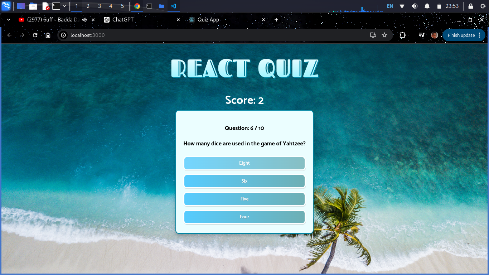

# Quiz App

This project is a quiz application built with TypeScript and React. It fetches quiz questions from the Open Trivia Database (OpenTDB) and allows users to answer multiple-choice questions.



## Table of Contents

- [Getting Started](#getting-started)
- [Available Scripts](#available-scripts)
- [API Integration](#api-integration)
- [Types and Enums](#types-and-enums)
- [Utility Functions](#utility-functions)
- [Contributing](#contributing)


## Getting Started

This project was bootstrapped with [Create React App](https://github.com/facebook/create-react-app) and configured to use TypeScript.

### Prerequisites

Ensure you have [Node.js](https://nodejs.org/) installed.

### Installation

1. Clone the repository:
    ```sh
    git clone https://github.com/Kip-rotich46/quiz-app.git
    ```
2. Navigate to the project directory:
    ```sh
    cd quiz-app
    ```
3. Install the dependencies:
    ```sh
    npm install
    ```

## Available Scripts

In the project directory, you can run:

### `npm start`

Runs the app in development mode.\
Open [http://localhost:3000](http://localhost:3000) to view it in the browser.

### `npm test`

Launches the test runner in interactive watch mode. Refer to the section about [running tests](https://facebook.github.io/create-react-app/docs/running-tests) for more information.

### `npm run build`

Builds the app for production to the `build` folder. The build is optimized for the best performance.

### `npm run eject`

**Note: this is a one-way operation. Once you `eject`, you can’t go back!**

## API Integration

The quiz questions are fetched from the Open Trivia Database API based on the specified amount and difficulty.

## Types and Enums

The app defines several TypeScript types and enums to manage the data:

- **Question**: Represents a quiz question.
- **Difficulty**: Enum for question difficulty levels (easy, medium, hard).
- **QuestionsState**: Extends `Question` with an additional `answers` field.

## Utility Functions

The app includes utility functions like `shuffleArray` to shuffle the answers for each question.

## Contributing

We welcome contributions to improve this project. Please feel free to submit a pull request or open an issue on our [GitHub repository](https://github.com/Kip-rotich46/quiz-app).


---

By following this guide, you should be able to get your quiz application up and running smoothly. If you have any questions or run into issues, please consult the documentation or reach out to the community for support. Happy coding!